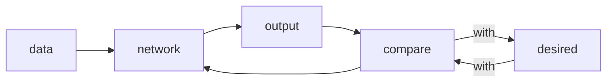
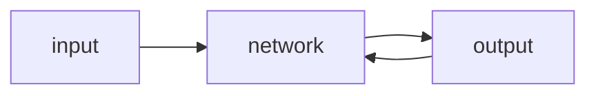

Deep learning is based on Artificial Neural Network, Neural Networks are excellent function approximators.

<!--more-->

## Backpropagation

The adjustment of weights is performed using Stochasitic Gradient Descent.

## FNN (FeedForward Neural Network)

- Usually fully connected

  **USE CASE: **Exceptional well on tasks like classification and regression

## CNN (Convolutional Neural Network)

- only connected to the receptive field
- good in identifying saptial relationships
- Ideal to combine with RNN and Autoencoders

**USE CASE:** CV, such as image classification, video recognition, self-driving

## RNN (Recurrent Neural Network)

- make it more complex: using GRU units and LSTM units

**USE CASE:** NLP

## Recursive Neural Network

- one form of RNN
- but structed in tree-like form
- can model hierachical structures
- But too slow

## AutoEncoders

- unsupervised algorithm

  **USE CASE:** dimensionality reduction and compression

  

- h is a representation with fewer dimensions

- the output is a bit different from the input

## RBM (Restricted Boltzmann Machines)

- able to learn a probability distribution over their input
- Similar to AutoEncoders but with single network

## DBN (Deep Belief Networks)

- is made of RBMs
- look like fully connected networks
- but differ in how they are trained

## GAN (Generative Adversarial Network)

- a generator
- a discriminator

**USE CASE: ** everywhere with images

## Transformers

- Attention Mechanism
- encoders
- decoders

**USE CASE: **NLP, sequenced data

Example: BERT, GPT-2

## Graph Neural Network

- transform graph data to numeric representation
- Just like embedding
- for further process

